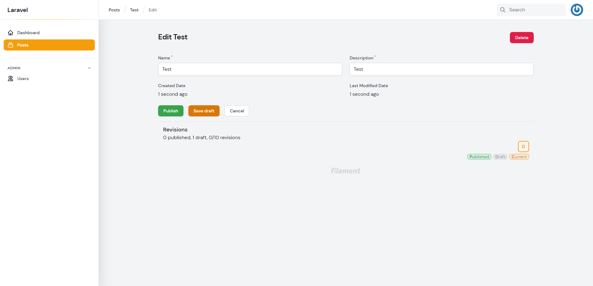
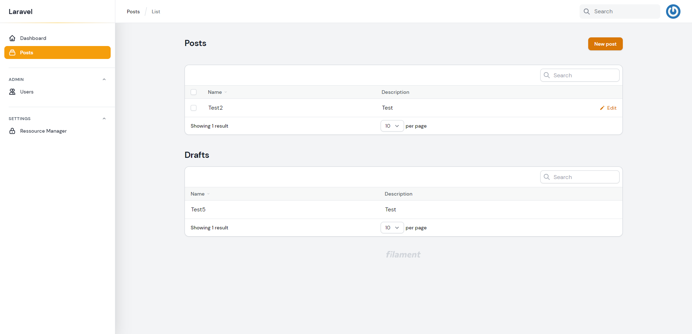
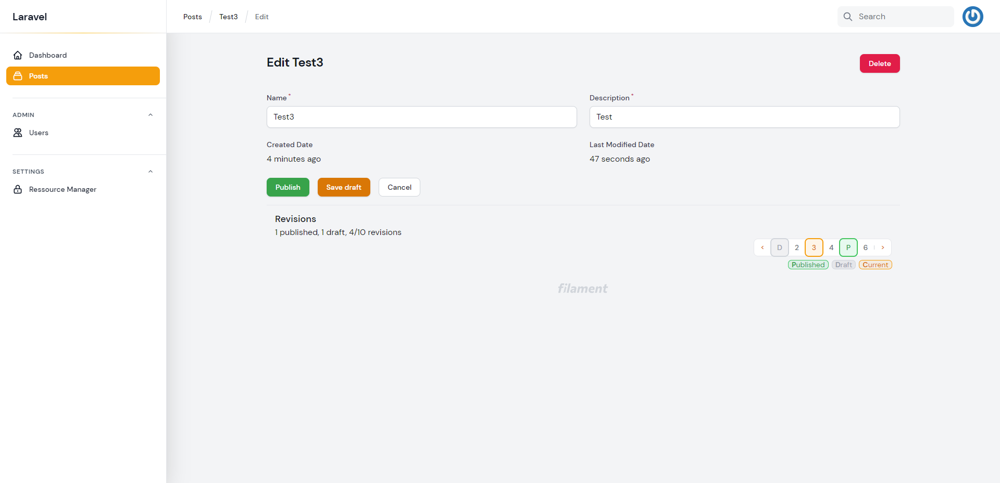

# Resource Drafts



Startify Drafts gives you the ability to manage and save
drafts and revisions for your resources. You just
need some basic setup. 

## Setup

Drafts are disabled by default. You can enable it in the configuration file.
Set `enable_resource_lock => true` in the ``filament-startify.php`` config:

```php:no-line-numbers
/*
|--------------------------------------------------------------------------
| Startify Drafts
|--------------------------------------------------------------------------
|
| Startify Drafts gives you the ability to manage and save
| drafts and revisions for your resources. You just
| need some basic setup. Please look inside the
| docs under Features/Drafts.
|
*/

'enable_drafts' => true,

```

## Prepare Files

Add the ``HasDrafts`` Trait to your model. 

```php:no-line-numbers
use DevelogixPackages\FilamentStartify\Traits\Drafts\HasDrafts;

class Post extends Model
{
    use HasDrafts;
    
    protected $fillable = [
        ...
        'is_published'
   ];
}
```

### Modify your model migration

You can simply add the ``$table->drafts();`` extension to your migration, or create 
a new migration and update your model with this extension.

```php:no-line-numbers
return new class extends Migration
{
    public function up(): void
    {
        Schema::create('posts', function (Blueprint $table) {
            //...
            $table->drafts();
        };
    }
}
```

> **Don't forget to add the `is_published` column to your $fillable property!**

### Resource/Page Traits

Next you need to add the extension Traits to your Resource and Pages.

#### Resource Trait
Add the ``Draftable`` trait to your model resource.

```php:no-line-numbers
use DevelogixPackages\FilamentStartify\Resources\Drafts\Concerns\Draftable;

class PostResource extends Resource
{
    use Draftable;
    ...
}
```

> Add the different ``Draftable`` traits to your resource pages.
>
> **(Be aware that each page uses a different trait from another namespace)**

#### Create Page

```php:no-line-numbers
use DevelogixPackages\FilamentStartify\Resources\Drafts\Pages\Create\Draftable;

class CreatePost extends CreateRecord
{
    use Draftable;
    ...
}
```

#### Edit Page

```php:no-line-numbers
use DevelogixPackages\FilamentStartify\Resources\Drafts\Pages\Edit\Draftable;

class EditPost extends EditRecord
{
    use Draftable;
    ...
}
```

#### List Page

```php:no-line-numbers
use DevelogixPackages\FilamentStartify\Resources\Drafts\Pages\List\Draftable;

class ListPosts extends ListRecords
{
    use Draftable;
    ...
}
```

## Configuration
You can define the amount of revisions saved in the database by simply 
change the config.

```php:no-line-numbers
/*
|--------------------------------------------------------------------------
| Startify Drafts Configuration
|--------------------------------------------------------------------------
|
| Here you can set the maximum amount of revisions
| you want to keep in your application.
|
*/

'drafts' => [
    'revisions' => [
        'keep' => 10
    ],
],
      
```

## Examples



