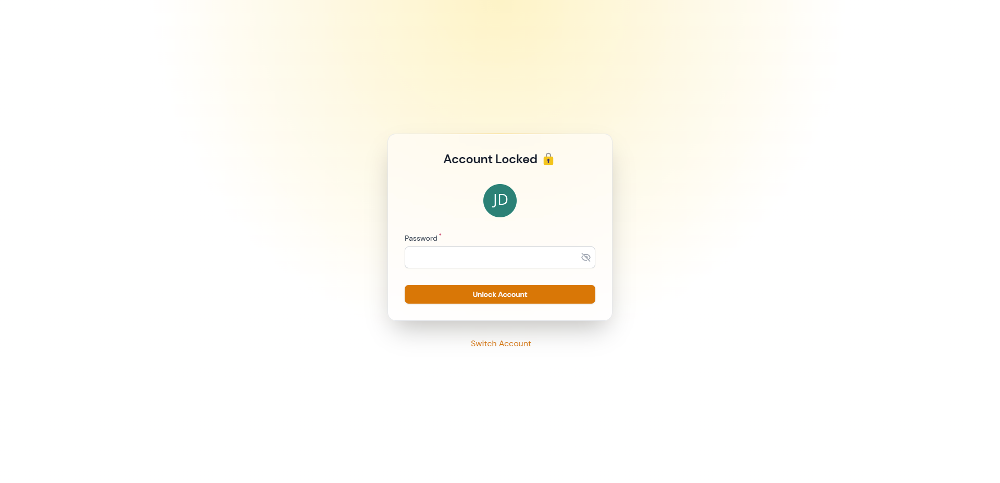
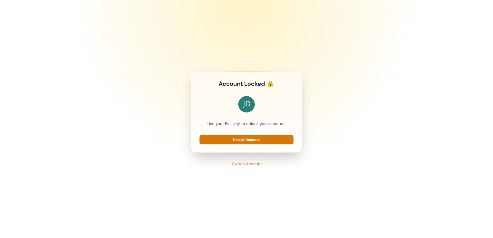
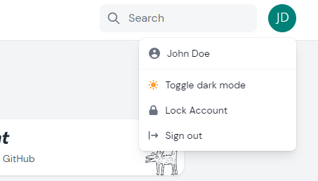

# Lock Screen
> Based on [filament-lockscreen by MarJose123](https://github.com/MarJose123/filament-lockscreen)


Lock Screen is a simple way to offer your users the possibility to 
lock their account without having to log in again. When an account 
is locked, it only needs the user's password, or if enabled, the 
passkey to get back to the application.

>In the future it is planned to introduce an idle timer, 
which will automatically lock the user after a certain time.

## Setup

To enable Lock Screen set `enable_lock_screen => true` in the ``filament-startify.php`` config:

```php:no-line-numbers
/*
|--------------------------------------------------------------------------
| Startify Lockscreen
|--------------------------------------------------------------------------
| 
| Lock Screen is a simple way to offer your users the possibility 
| to lock their account without having to log in again. When 
| an account is locked, it only needs the user's 
| password, or if enabled, the passkey to get 
| back to the application.
|
*/

'enable_lockscreen' => true,

```

## Configuration
```php:no-line-numbers
/*
|--------------------------------------------------------------------------
| Startify Lockscreen Configuration
|--------------------------------------------------------------------------
|
| Afterwords you can define some additional configurations
| for your Lock Screen. Please refer to the Docs for a
| detailed Documentation.
|
*/

'lockscreen' => [
    /* The icon which is shown in the usermenu */
    'icon' => 'heroicon-s-lock-closed',
    
    /* The url which the Lock Screen will point to */
    'url' => '/locked',
    
    /* 
    * If you define 'force_logout' to 'true' the app will 
    * logout the user after rate_limit is reached 
    */
    'rate_limite' => [
        'force_logout' => false
    ],
    
    /* 
    * You can define which segments of the path will be locked.
    * If 'specific_path_only' is set to true you can define segments like
    * 'locked_path' => ["admin","users"] which will lock every site in this paths.
    * For example example.com/admin and example.com/users.
    * If you set 'segment_needle' to 2 everything underneath will be locked like: 
    * example.com/admin/posts.
    *
    * See details under: 
    * https://laravel.com/api/10.x/Illuminate/Http/Request.html#method_segment
    */
    'segment' => [
        'specific_path_only' => false,
        'segment_needle' => 1,
        'locked_path' => [], 
    ],
]
    
```

>Details to Segment Needle checkout [Laravel Illuminate Request](https://laravel.com/api/10.x/Illuminate/Http/Request.html#method_segment).

## Examples

### With Password


### With Passkey


### Usermenu Button

