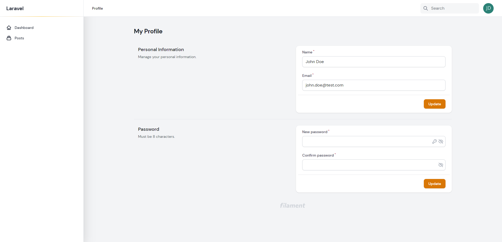
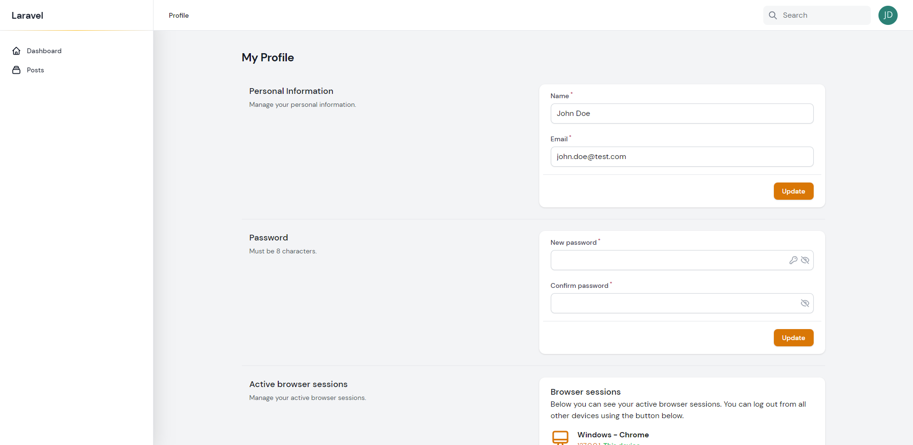

# Profile Page



Similar to [Extending Components](../auth-handler/components.md), you can add new fields to your Profile forms by extending the Filament Page:

```php:no-line-numbers
namespace App\Filament\Pages;

use DevelogixPackages\FilamentStartify\Pages\Profile as BaseProfile;
use Filament\Forms;

class Profile extends BaseProfile
{

  // ..

  protected function getUpdateProfileFormSchema(): array
    {
        return array_merge(parent::getUpdateProfileFormSchema(), [
            Forms\Components\TextInput::make("job_title"),
            Forms\Components\Checkbox::make("marketing_consent")->label(
                "I consent to receive email notifications....."
            ),
        ]);
    }
```

You will then need to set `"enable_profile_page" => false,` in ``filament-startify.php`` config
to unregister the default Profile page. 

When you set `"enable_profile_page" => false,`
then `"show_profile_page_in_user_menu" => true` is ignored, and you will
need to [manually register a new item](https://filamentphp.com/docs/2.x/admin/navigation#customizing-the-user-menu) for
the user menu within your service provider:

```php:no-line-numbers
use App\Filament\Pages\MyProfile;

Filament::serving(function () {
    
    // ..
    
    Filament::registerUserMenuItems([
        'account' => UserMenuItem::make()->url(Profile::getUrl()),
    ]);
    
    // ..
    
});
```

>*NOTE:* in order to add new sections to the Profile page,
you will need to extend the class and publish/create your own views.
The above method will only allow for adding new fields to the existing
Personal Information or Password forms.

## Example
