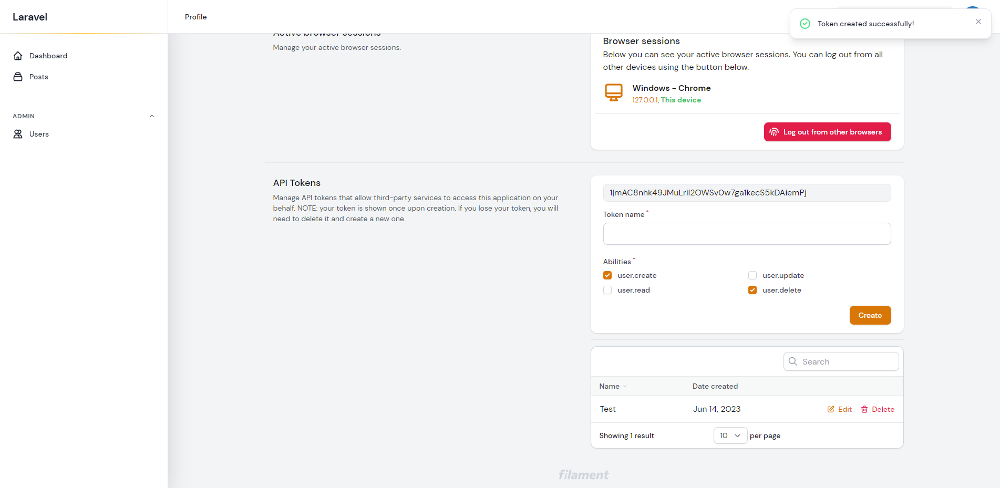

# Sanctum API Tokens


The most recent version of Laravel include Sanctum, but if you don't already
have the package follow the [installation instructions here](https://laravel.com/docs/10.x/sanctum#installation).

As soon as Sanctum is installed, you are ready to allow users to create new API tokens f
rom the Profile page. 

## Setup

Set `enable_sanctum => true` in the ``filament-startify.php`` config:

```php:no-line-numbers
/*
|--------------------------------------------------------------------------
| Laravel Sanctum API Token
|--------------------------------------------------------------------------
|
| Afterwords you can enable or disable API Token management for
| your application powered by Laravel Sanctum.
|
*/

'enable_sanctum' => false,

```

## Configuration

You can then control the available permissions abilities from the config, which will add each ability as a checkbox:

```php:no-line-numbers
/*
|--------------------------------------------------------------------------
| Laravel Sanctum Token Permissions
|--------------------------------------------------------------------------
|
| Option to define your custom token permission scopes.
|
*/

'sanctum_permissions' => ['create', 'read', 'update', 'delete'],

```

Follow the Sanctum instructions for authenticating requests as usual.
