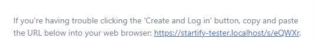

# Startify Url Shortener


If enabled Startify has a built-in Url Shortener for common Tasks
like sending verification Mails etc. The default urls are long
and ugly, so we have a solution for that. 

>You can also use the Facade in your app. 
## Migration

Publish the migrations to use the Url Shortener.

```bash:no-line-numbers
php artisan vendor:publish --tag="startify-short-url-migration"
php artisan migrate
```

## Setup

By default, the Url Shortener is disabled, you can enable it in the config:

Set `'enable_short_url' => true` in the ``filament-startify.php`` config:

```php:no-line-numbers
/*
|--------------------------------------------------------------------------
| Startify Url Shortener
|--------------------------------------------------------------------------
|
| If enabled Startify has a built-in Url Shortener for common Tasks
| like sending verification Mails etc. The default urls are long
| and ugly, so we have a solution for that. You can also use
| the Facade in your app. For details refer to the Docs.
|
| Documentation:
| https://startify-docs.develogix.at/features/short-url/usage.html
|
*/

'enable_short_url' => false,

```

## Usage
The easiest way to use this feature in your own application is buy using
the ``ShortUrl`` Facade.

#### Example usage:

````php:no-line-numbers
$shortUrlObj = ShortUrl::destinationUrl('https://example.com')
                    ->make();
                    
$shortURL = $shortUrlObj->default_short_url;
````

#### Custom Key
You can set a custom key to have a more meaningful Url than
a custom one.

````php:no-line-numbers
$shortUrlObj = ShortUrl::destinationUrl('https://example.com')
                    ->urlKey('my-custom-key')
                    ->make();
                    
$shortURL = $shortUrlObj->default_short_url;
//output: https://mydomain.com/s/my-custom-key
````

#### Forwarding Query Parameters
When creating a short url, you might sometimes 
need to forward the query params in the request.

````php:no-line-numbers
$shortUrlObj = ShortUrl::destinationUrl('https://example.com')
                    ->forwardQueryParams()
                    ->make();
                    
$shortURL = $shortUrlObj->default_short_url;
````

#### Redirect Status Code
By default, the urls have the HTTP status code ``302`` in order
to prevent caching. In some cases you want to use ``301`` to 
permanently forward calls to a specific url.

````php:no-line-numbers
$shortUrlObj = ShortUrl::destinationUrl('https://example.com')
                    ->redirectStatusCode(302)
                    ->make();
                    
$shortURL = $shortUrlObj->default_short_url;
````

#### Activation and Deactivation Times
You can set activation and deactivation times. 
It's useful if you plan the use specific short url in campaigns or
on urls which should be only accessible once. See next step.

````php:no-line-numbers
$shortUrlObj = ShortUrl::destinationUrl('https://example.com')
                    ->activateAt(now()->addDay())
                    ->deactivateAt(now()->addDays(2))
                    ->make();
                    
$shortURL = $shortUrlObj->default_short_url;
````

#### Single use
You can define a single use domain. 
It's recommend to also set a ``deactivatedAt`` param
so that the Scheduler can clean the old already used Domains.
If used once, the visitor gets at the next visit a ``404 Error`` 
so think about implementing a 404 page in your app.

````php:no-line-numbers
$shortUrlObj = ShortUrl::destinationUrl('https://example.com')
                    ->singleUse()
                    ->deactivateAt(now()->addDays(2))
                    ->make();
                    
$shortURL = $shortUrlObj->default_short_url;
````

#### Tracking
U can override the default tracking behavior of the docs 
directly on the builder instance:

````php:no-line-numbers
$shortUrlObj = ShortUrl::destinationUrl('https://example.com')
                    ->trackVisits(true|false)
                    ->trackIPAddress(true|false)
                    ->trackBrowser(true|false)
                    ->trackBrowserVersion(true|false)
                    ->trackOperatingSystem(true|false)
                    ->trackOperatingSystemVersion(true|false)
                    ->trackDeviceType(true|false)
                    ->trackRefererURL(true|false)
                    ->make();
                    
$shortURL = $shortUrlObj->default_short_url;
````


## Configuration

The Url Shortener comes with a bunch of configurations.
By default, you don't need to change anything in the configuration.


```php:no-line-numbers
/*
|--------------------------------------------------------------------------
| Startify Url Shortener Configuration
|--------------------------------------------------------------------------
|
| You can configure the default behaviour of the
| Url Shortener down below or refer to the Docs.
|
| Documentation:
| https://startify-docs.develogix.at/features/short-url/usage.html#configuration
|
*/

'short_url' => [
    /* The prefix is used inside the route */
    'prefix' => '/s',
    
    /* If set to true the url generated is inside the path e.g. /admin/s/xxx */
    'under_filament_path' => false,
    
    /* Custom middleware which should be used */
    'middleware' => [
    //
    ],
    
    /* You can override the default application url */
    'default_url' => null,
    
    /* If set to true all query params will be forwarded */
    'forward_query_params' => false,
    
    /* Enforces HTTPS on the destination url */
    'enforce_https' => true,
    
    /* The key_lenght describes the length of the keys inside the 
     * short url. E.g. /s/xxxxx
     */
    'key_length' => 5,
    
    /* You can define a custom char list. By default the whole alphabet is used */
    'possible_chars' => null,
    
    /* Here you can tell the Shortener which parts should be tracked.
     * By default, everything is tracked and saved to the Database.
     */
    'tracking' => [
        'default_enabled' => true,
        'fields' => [
            'ip_address'               => true,
            'operating_system'         => true,
            'operating_system_version' => true,
            'browser'                  => true,
            'browser_version'          => true,
            'referer_url'              => true,
            'device_type'              => true,
        ],
    ],
],

```


## Clean up

After some time the Database is getting quite messy.

>There is built-in Scheduler which clears all expired Short Url 
twice a day.

To solve this issue you can simply run following command:
+ ``php artisan clear:short-urls [--all|-A]`` 
> If ``--all`` or `-A` is present it will clear all records available.
> If not it will only clear all records which past the ``deactivated_at`` timestamp