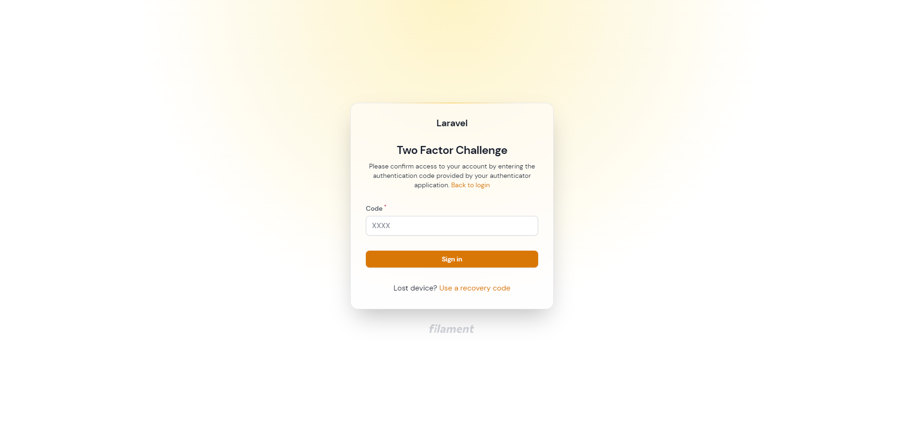
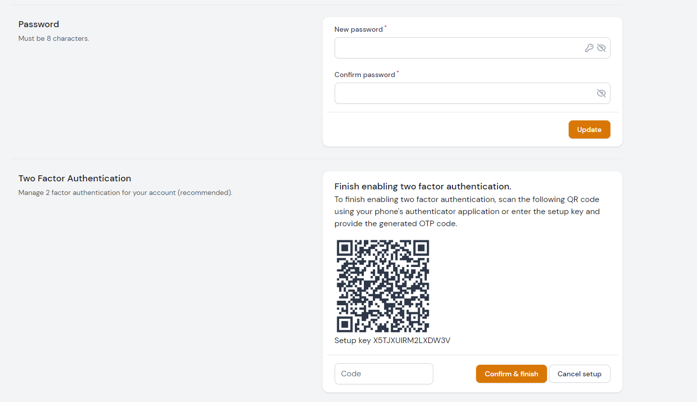
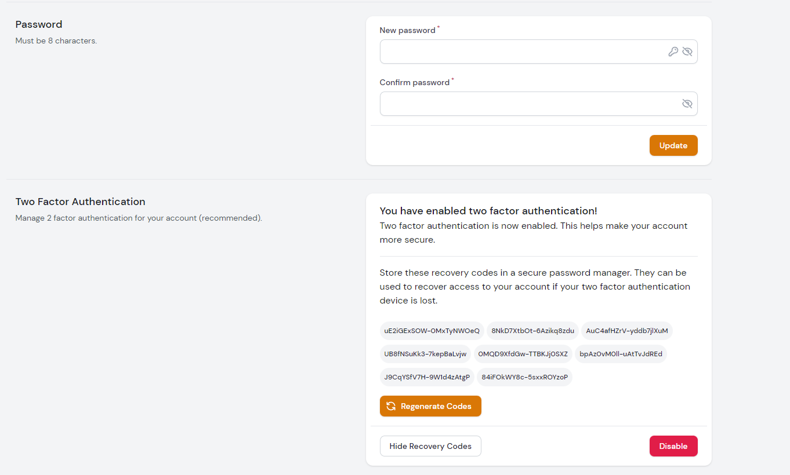

# Enable 2FA (Two-Factor Authentication)

>***HINT**: If you have passkeys enabled in your application you're no longer able
to use Two-Factor Auth.*

## Migrations
```bash:no-line-numbers
php artisan vendor:publish --tag="startify-two-factor-migration"
php artisan migrate
```

## Setup

2FA is disabled by default. You can enable it in the configuration file.

Set `enable_2fa => true` in the ``filament-startify.php`` config:

```php:no-line-numbers
/*
|--------------------------------------------------------------------------
| Enable Two-Factor Authentication (2FA).
|--------------------------------------------------------------------------
|
| Subsequently, 2-factor authentication can be enabled for your
| platform. This is only available as long as you are not
| using Passkey (Passwordless) Authentication.
|
*/

'enable_2fa' => false,

```

>*NOTE:* if you are using a model other than `User::class`,
you can update the table name in the ``filament-startify.php`` config
or modify the published migration.

## Add to User

Add `DevelogixPackages\FilamentStartify\Traits\TwoFactor\HasTwoFactor` to your Authenticatable model:

```php:no-line-numbers
use DevelogixPackages\FilamentStartify\Traits\TwoFactor\HasTwoFactor;

class User extends Authenticatable
{
    use HasApiTokens, HasFactory, Notifiable, HasTwoFactor;
    ...
```

## Examples

