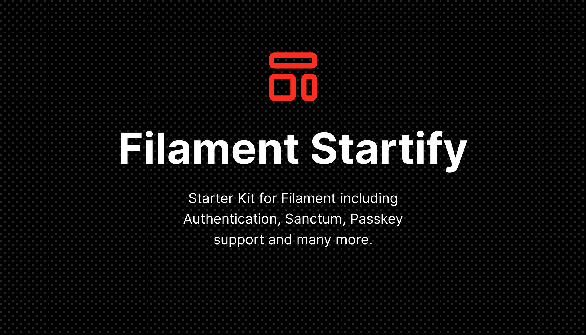

# Filament Startify

## Features
Startify is capable of many feature see following list:
- Full Auth-Kit 🔐 [Usage/Docs](features/auth-handler/routing.md)
- Two-Factor Authentication 📱 [Usage/Docs](features/two-factor/usage.md)
- Passkey Support (Passwordless Login) 🔑 [Usage/Docs](features/passkey/usage.md)
- Lock Screen 🔒 [Usage/Docs](features/lock-screen/usage.md)
- User Profile 🏠 [Usage/Docs](features/profile/profile-page.md)
- Dynamic Profile Picture (UI-Avatar or Gravatar) 🖼️ [Usage/Docs](features/profile/profile-picture.md)
- Browser Session Manager 💻 [Usage/Docs](features/browser-session/usage.md)
- Apple like Spotlight Search 🔍 [Usage/Docs](features/spotlight/usage.md)
- Dynamic Resource Locking 🔒 [Usage/Docs](features/resource-lock/usage.md)
- Resource Drafts with revisions 📄 [Usage/Docs](features/drafts/usage.md)
- Url Shortener 💻 [Usage/Docs](features/short-url/usage.md)

## License key
Grab your License at
<a id="go-to-anystack" href="#">AnyStack.sh - Filament Startify</a>.
\
*[FilamentPHP](https://filamentphp.com) is getting a commission for every purchase, 
support their and my work.*

## Documentation

See the documentation for detailed 
[installation](getting-started/index.md) and [usage](features/auth-handler/routing.md) instructions.

## Issues

Please visit my public [Startify Docs](https://github.com/develogix-packages/filament-startify-docs)
repository for any issue reports.

## Attribution
I have not developed everything on my own! I've used some well codes 
open-source packages and will also give the right attribution to the 
creators.

My intention with this package is to boost up your workflow, by combining
this available features into one package and make work together like charm.

## License

This package is licensed under the [Custom License](license.md).

